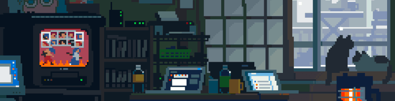

  

<h2 align="center">Hello &#x3C;\coders&#x3E; 🌏</h2>
<h3 align="center">Backend Developer | RUDN University Student | School 21</h3>

---

### 👨‍🎓 About Me

| | |
|:---|:---|
| **🏛️ University** | RUDN University (Patrice Lumumba Peoples' Friendship University of Russia) |
| **📐 Major** | Applied Mathematics and Computer Science |
| **🚀 Specialization** | Mathematical Methods of Flight Mechanics of Launch Vehicles and Spacecraft |
| **🎓 School 21** | nickname - `bulakath`, development in **C** |

 

I've spent a significant amount of time writing code in **C** as part of School 21 projects. This gave me a deep understanding of memory management, algorithms, and software architecture. Now, I'm purposefully developing myself as a 🎯**Java backend developer**, applying the discipline and systematic approach honed through low-level programming.

---

  
### 🚀 Projects

| Project | Technologies | Description | Status |
|:--------|:-------------|:------------|:-------|
| **CleanerBot** | `Java`, `Maven`, `SQLite`, `Telegram Bots API` | Telegram-бот для организации уборки в общих помещениях. Позволяет создавать комнаты, приглашать участников, планировать задачи и расписания| 🚧 In Progress |
| **S21_StringPlus** | `C`, `Make` | Implementation of the string.h library with additions, including own implementation of sprintf and sscanf functions | ✅ Completed |
| **TicTacToe** | `Java` | Simple console-based Tic-Tac-Toe game for two players (human vs human). Features 3x3 board, turn-based input, win/draw detection, and input validation | ✅ Completed |
| **SimplePingPong** | `Java` | Simple console-based Ping Pong game with basic game loop, player controls, and ball physics rendered entirely in the terminal | ✅ Completed |
| **OpenSky** | `Java`, `Swing` | Desktop weather application with graphical user interface. Displays temperature, weather conditions, humidity and wind speed for Moscow and Makhachkala. Created to learn Java Swing fundamentals | ✅ Completed |

  
### ⚡️ My skills

  
  
  
  
  
  
  
          
          

                     
---

  
### 📫 Contact Me

📱 **Telegram:** [@ekhest21](https://t.me/ekhest21)  
✉️ **Email:** [ekhestt@yandex.ru](mailto:ekhestt@yandex.ru)

